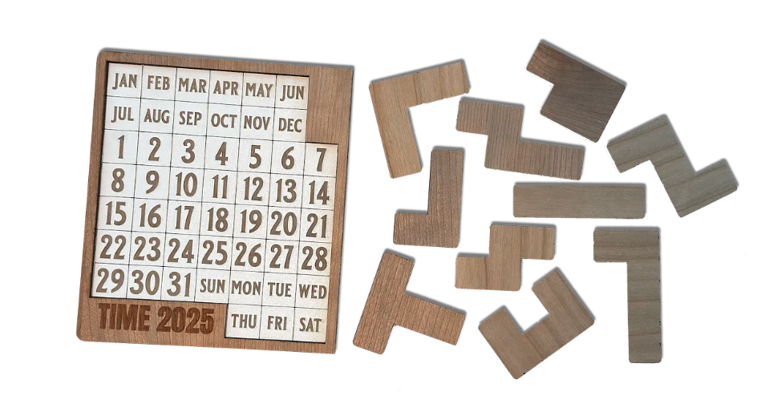
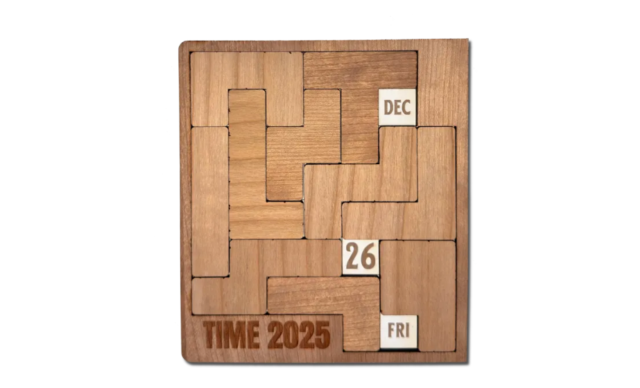

# Imperial Earth Calendar Puzzle Solver

A solver for the **Imperial Earth Calendar Puzzle**.

🔗 **[Try it live](https://yiz-bit.github.io/imperial-earth-calendar-solver/)**

 

## What is this?

**Imperial Earth Calendar Puzzle** is a physical puzzle (a variant of the popular [DragonFold / daily calendar puzzles](https://www.dragonfjord.com/product/a-puzzle-a-day/)) where you place ten polyomino pieces on a board to leave exactly three cells uncovered — today's month, day, and weekday. This computational tool solves it for you instantly.

## Problem Description

### The Board
* An **8×7 grid** with some blocked cells.
* Contains months (JAN-DEC), days (1-31), and weekdays (SUN-SAT).
* Total play area: **50 valid cells**.

### The Goal
* Place all 10 pieces to cover exactly **47 cells**.
* Leave exactly **3 cells uncovered**: your target month, day, and weekday.
* Each piece can be freely rotated and flipped into any valid orientation.

### The Pieces
10 polyomino pieces of various shapes:
* **7 pieces** with 5 cells each (pentominoes).
* **3 pieces** with 4 cells each (tetrominoes).
* Total coverage: **47 cells**.

*Sample solution for “Friday, December 26”*

## How to use

1. Select the **month**, **day**, and **weekday**
2. Click **Solve Puzzle**
3. Use **Hint** to reveal pieces one at a time, or **Show All** for the full solution
4. Click **Clear Board** to start over

## Run locally

Just open `index.html` in your browser — no installation needed.
